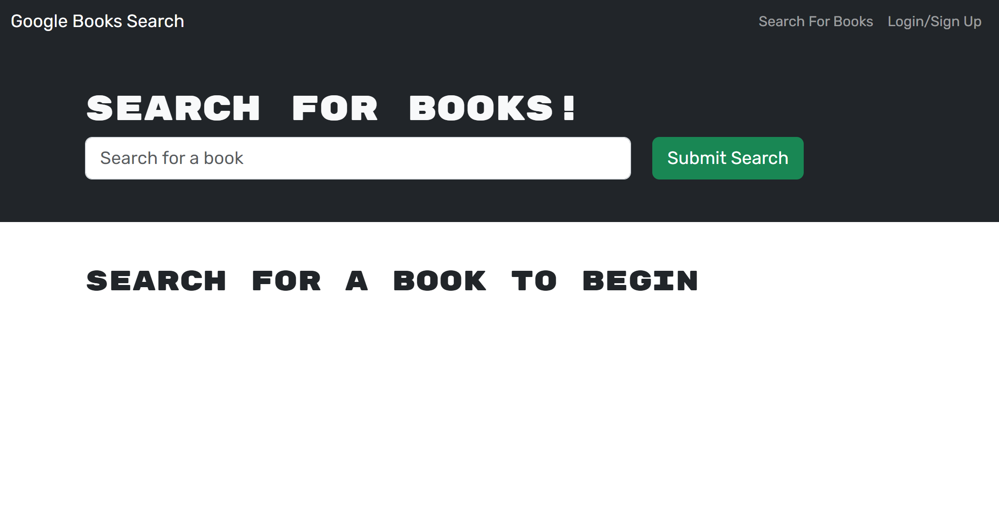

# Book Search Engine

## Description
This website [website](https://book-search-engine-fnta.onrender.com/) functions as a book search engine where users can create a profile to manage their reading list. The data is obtained from Google's Books API. The website is created using refactored code from GitHub user Xandromus.

## Usage
 
Upon entering the app, users will see a homescreen with a search bar and two links: "Search For Books" and "Login/Sign Up." They can use the search bar to enter the title of a book and find it through Google's BooksAPI. Clicking on "Login/Sign Up" will bring up a modal where users can log in or sign up with a username, email, and password. After logging in, users can search for books, which will generate a card with the book cover image, title, author's name, and a book description. Users can save a book to their list by clicking the "save book" button on the card. To view their saved books, users can go to the nav bar and click on the "saved books" link.

## Credits
This code was refactored from starter code from GitHub user Xandromus. The code was also built by recreating examples from excercises worked through the course.

## License
This project is licensed under the  - see the [MIT License.md](https://opensource.org/licenses/MIT) file for details.

## Questions
Github Username: Jorge-Baldovinos

## Tests
no
